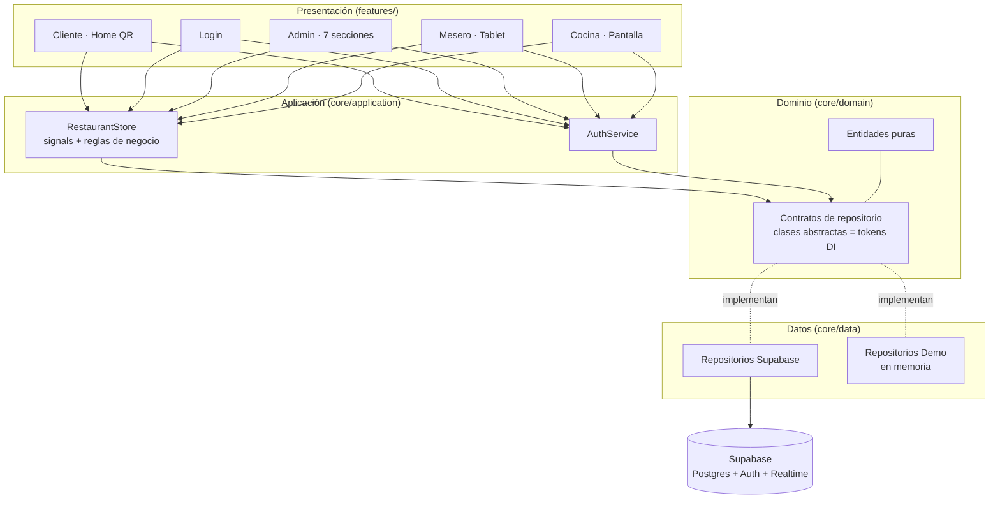
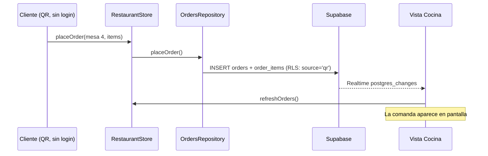
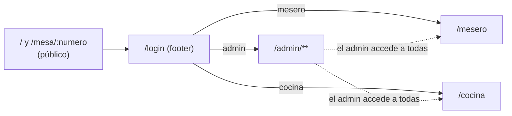

# Arquitectura

## Visión general

**Restaurante Staff** es una plataforma open source para restaurantes con cuatro vistas sobre un mismo estado: el cliente pide desde el QR de su mesa, cocina prepara, el mesero sirve y administración gestiona todo el local.

La app sigue **clean architecture** en tres capas dentro de Angular, con Supabase como backend (Postgres + Auth + Realtime) y un **modo demo** en memoria cuando no hay credenciales.



## Tecnologías

| Tecnología | Uso | Versión |
|---|---|---|
| Angular (standalone + signals) | Frontend SPA | 22 |
| Tailwind CSS | Estilos con design tokens del mockup | 4 |
| Supabase (`@supabase/supabase-js`) | Base de datos, Auth, Realtime | 2.x |
| Vitest | Pruebas unitarias (`ng test`) | 4 |
| Playwright | E2E de diseño y funcionalidad | 1.x |
| TypeScript estricto | Tipado en todas las capas | 6 |

## Flujo de datos

1. Un componente llama a un método del `RestaurantStore` (p. ej. `placeOrder`).
2. El store aplica la regla de negocio, actualiza sus **signals** (UI reactiva inmediata) y delega la persistencia en el **contrato** de repositorio.
3. La implementación activa (Supabase o demo) persiste el cambio.
4. Los cambios externos llegan por **Realtime** (`onChange`) y refrescan los signals: cocina ve el pedido del cliente sin recargar.



## Estructura de carpetas

```
src/app/
├── core/
│   ├── domain/
│   │   ├── entities/entities.ts        # Tipos puros + reglas (orderTotal…)
│   │   └── repositories/repositories.ts# Contratos (clases abstractas)
│   ├── application/restaurant.store.ts # Estado global con signals
│   ├── data/
│   │   ├── supabase/                   # Cliente único + repos reales
│   │   └── demo/                       # Datos del diseño + repos en memoria
│   ├── auth/                           # AuthService + roleGuard
│   └── core.providers.ts               # Selección Supabase/demo (único punto)
├── features/
│   ├── client/                         # Home pública (menú QR)
│   ├── auth/                           # Login del personal
│   ├── admin/                          # Layout + plano/pedidos/menú/categorías/meseros/pagos/temporada/ajustes
│   ├── waiter/                         # Tablet del mesero
│   ├── cashier/                        # Caja del cajero (cobro por método de pago)
│   └── kitchen/                        # Pantalla de cocina
└── shared/                             # Toast, pipe de moneda, topbar, mapas UI, QR por mesa (table-qr)
supabase/
├── migrations/                         # Esquema + RLS versionados
└── seed.sql                            # Datos de ejemplo (los del diseño)
e2e/                                    # Playwright
docs/ · tasks/                          # Documentación viva
```

## Comunicación entre módulos

- **Presentación → Aplicación**: los componentes solo leen signals y llaman métodos con intención (`advanceOrder`, no `update(...)`).
- **Aplicación → Dominio**: el store depende de los contratos abstractos; nunca importa Supabase.
- **Datos → Dominio**: cada repositorio implementa un contrato y mapea snake_case ⇄ camelCase.
- **Autorización**: `roleGuard(rol)` protege `/admin`, `/mesero`, `/cocina`; la autoridad real vive en las **políticas RLS** del servidor.
- **Rutas por rol**:


